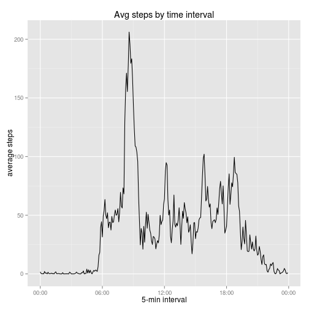
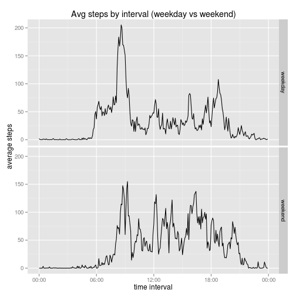

## Loading and preprocessing the data


```r
activityData<-read.csv("activity.csv", header = T)
```

Once the data is read, there are a number of questions we must ask using it. 


```r
sapply(activityData, class)
```

```
##     steps      date  interval 
## "integer"  "factor" "integer"
```

One thing we are gonna need for sure is to manipulate the interval variable, so we can work with the dates on a proper way. First we convert the variable to character, then we get attach some zeros to the ones that are less than 4 characters long. This way, we make sure we can later parse them in the correct format (hours:minutes). 


```r
activityData$interval<-as.character(activityData$interval)

for (i in 1:length(activityData$interval)) {
        while (nchar(activityData$interval[i])<4) {
                activityData$interval[i]<-paste("0", 
                                               activityData$interval[i], 
                                               sep = ""); 
                if(nchar(activityData$interval[i])==4) break}
}

sum(nchar(activityData$interval)!=4)
```

```
## [1] 0
```


Now that we have reasonably clean data, we can start investigating.


```r
library(ggplot2)
library(dplyr)
```

```
## 
## Attaching package: 'dplyr'
## 
## The following objects are masked from 'package:stats':
## 
##     filter, lag
## 
## The following objects are masked from 'package:base':
## 
##     intersect, setdiff, setequal, union
```

## What is mean total number of steps taken per day?


```r
stepsbyday<-activityData %>% 
        group_by(date) %>% 
        summarise (total = sum(steps), 
                   mean = mean(steps, na.rm = T), 
                   median = (median(steps, na.rm = T)))
options(scipen = 6)
totalmean<-mean(stepsbyday$total, na.rm = T)
totalmedian<-median(stepsbyday$total, na.rm = T)
```

Mean steps taken by day is 10766.1887.

Median steps taken by day is 10765.


```r
bydayhist<-qplot(stepsbyday$total)
bydayhist + geom_histogram()
```

```
## stat_bin: binwidth defaulted to range/30. Use 'binwidth = x' to adjust this.
## stat_bin: binwidth defaulted to range/30. Use 'binwidth = x' to adjust this.
```

 


## What is the average daily activity pattern?


```r
intervalsteps<- activityData %>%
        group_by(interval) %>%
        summarise(average = mean(steps, na.rm =T))

#change format to something readable

intervalsteps$interval<-as.POSIXlt(intervalsteps$interval, format = "%H%M")
```


```r
q2<-ggplot(intervalsteps, aes(x = interval, y = average))
library(scales)
q2+geom_line() + scale_x_datetime(labels = date_format("%H:%M"))
```

 


## Imputing missing values

A quick check for getting to know how the na values are distributed.


```r
table(with(activityData, tapply(steps, date, FUN = function(x) sum(is.na(x)))))
```

```
## 
##   0 288 
##  53   8
```

This shows clearly that there are just two types of days: the ones on which every interval was monitored and the ones on which no interval was monitored. Hence, we can not impute the missing values using the mean/median for the day, but instead we must use the center value of the 5-minute interval.

A quick check on the differences between mean and median for each interval reveals that, in some of the intervals, differences are quite high between the 2 values:

```r
medians<-with(activityData, tapply(steps, interval, FUN = function(x) median(x, na.rm = T)))
means<-with(activityData, tapply(steps, interval, FUN = function(x) mean(x, na.rm = T)))
differences<-means-medians
plot(differences, type = "l")
```

 

Considering that the max value in the means is 206.1698, a maximum difference of `max(differences)` between the mean and the median seems to imply that there is a (strong) skew on the data. When data is skewed, median is usually a better indicator of the center of the distribution, since it is more robust to outliers, so we decide to impute based on that. With the data that we have, we can't do better.


```r
#copy of the dataset
activityImpute<-activityData
#compute medians for each interval
medians<-activityData %>%
        group_by(interval) %>%
        summarise(median = median (steps, na.rm = T))
#get a vector of rows that have na values
nas<-which(is.na(activityImpute$steps))
#impute based on that
for (i in 1:length(nas)){
        activityImpute[nas[i], "steps"]<- 
                medians$median[medians$interval == activityImpute[nas[i], "interval"]]
}
```

One obvious consequence of imputation using the median in this case is that, since it is (almost always) lower than the mean, general values for the distribution should have "dropped". Let's check with an histogram of steps by day (the same as the first question) but with the new data.


```r
actImputedDay<-activityImpute %>%
        group_by(date) %>%
        summarise (total = sum(steps))
meanImp<-mean(actImputedDay$total)
medianImp<-median(actImputedDay$total)
```

The mean of the new dataset with the imputed data is 9503.8689 while the mean of the original dataset before the imputation was 10766.1887.

The median of the imputed data is 10395 while the median of the original dataset before the imputation was 10765.

Now the histogram:


```r
impdayhist<-qplot(actImputedDay$total)
impdayhist + geom_histogram()
```

```
## stat_bin: binwidth defaulted to range/30. Use 'binwidth = x' to adjust this.
## stat_bin: binwidth defaulted to range/30. Use 'binwidth = x' to adjust this.
```

 


## Are there differences in activity patterns between weekdays and weekends?


```r
library(lubridate)
activityImpute$weekday<-ifelse(wday(activityImpute$date)>1 & #1 = sunday
                               wday(activityImpute$date)<7,  #7 = saturday
                               "weekday", 
                               "weekend")

wdaydata<-activityImpute %>%
        group_by(interval, weekday) %>%
        summarise(mean = mean(steps))

wdaydata$interval<-as.POSIXlt(wdaydata$interval, format = "%H%M")

wdaydata$weekday<-as.factor(wdaydata$weekday)
```


```r
graph<-ggplot(wdaydata, aes(x = interval, y = mean))
graph + geom_line() + facet_grid(weekday~.) + scale_x_datetime(labels = date_format("%H:%M"))
```

 
